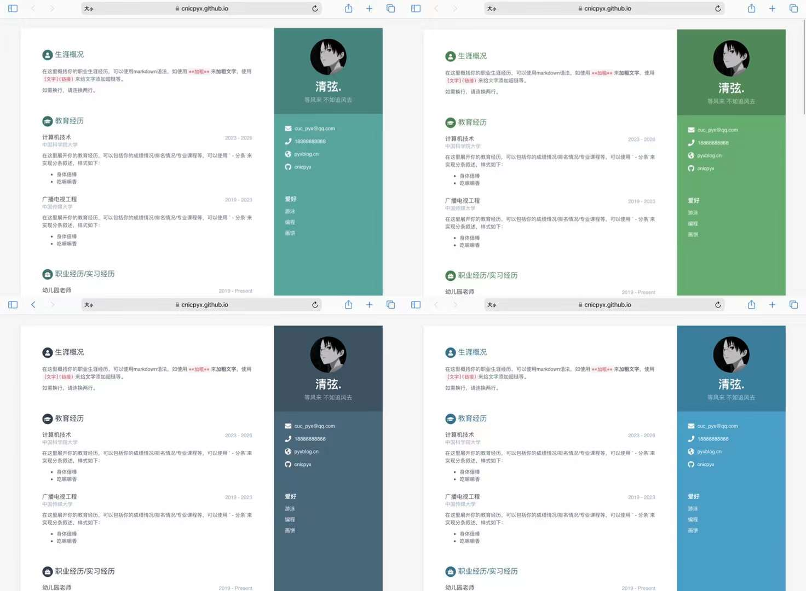
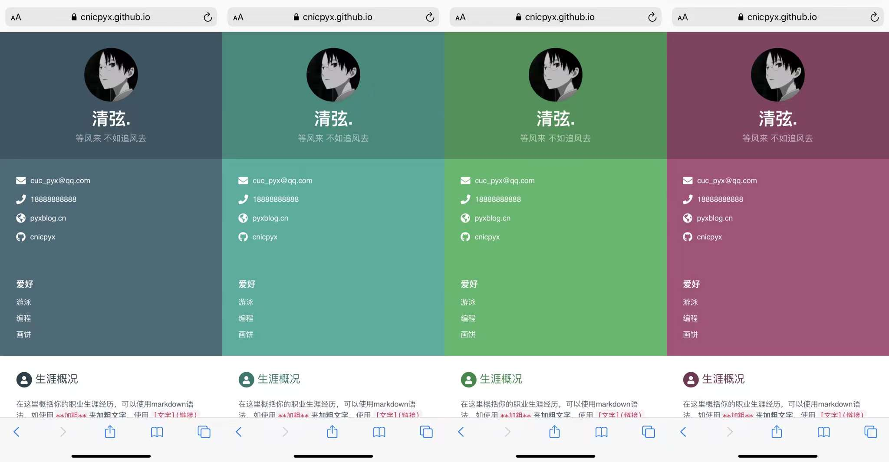

# 在线个人主页

部署教程请参考：[传送门](https://pyxblog.cn/2023/07/04/online-cv-2/)

效果预览请参考：[传送门](https://cnicpyx.github.io/online-cv/)

请前往：

* `_data/data.yml`文件中修改内容
* `_config.yml` 文件中修改配色

效果预览：

原项目地址：[传送门](https://github.com/sharu725/online-cv)，感谢开源
